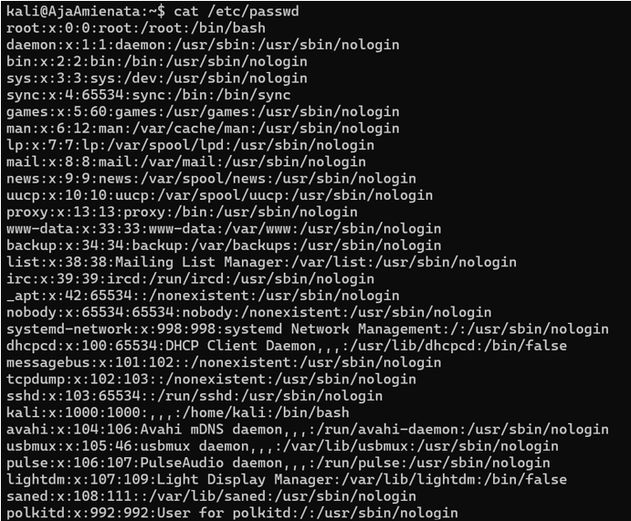

# Linux User & Permissions Analysis

**Author:** Aja Amienata Sanyang  
**Type:** Independent Linux security lab

---

## Overview
This project explores **user account management** and **file permissions** in a Linux environment.  
The goal was to investigate how Linux manages user identities, privileges, and access to directories, using simple commands to reveal important security configurations.

---

## Tools Used
- Linux (Kali)
- Bash commands (`cat`, `getent`, `ls`)

---

## Objective
- Review the `/etc/passwd` file to list system accounts  
- Identify which users have **administrative privileges (sudo group)**  
- Check folder permissions for home directories and the Desktop folder  

---

## Commands & Outputs

### 1. List all user accounts
    cat /etc/passwd

---

### **2. Check who has sudo privileges**
    getent group sudo

---

### **3. Inspect folder permissions (/home/kali)**
    ls -ld /home/kali

---

### **4. Inspect Desktop folder permissions**
    ls -l /home/kali/Desktop

---

## Key Findings
- The system contains many service accounts as well as the primary user (`kali`).  
- Only the `kali` account has administrative (`sudo`) privileges.  
- Folder permissions for `/home/kali` are restricted to the owner only.  
- The Desktop directory is empty but permissions are correctly enforced.  

---

## Detection & Mitigation
- **Detection:** System administrators can monitor `/etc/passwd` and `sudo` group membership changes via SIEM or log auditing.  
- **Mitigation:** Use principle of least privilege, enforce strong passwords, and monitor folder permissions regularly.  

---

## What I Learned
- The `/etc/passwd` file provides visibility into system and user accounts.  
- Membership in the `sudo` group grants administrative rights.  
- Permissions (`ls -ld`) are critical for maintaining proper access control.  
- Security relies on both system configuration and ongoing monitoring.  

---

### **Ethical Note**
This exercise was performed in a controlled environment on my own Kali Linux system.  
No unauthorised access to external systems was attempted.  
The activity was strictly for learning and security awareness purposes.

